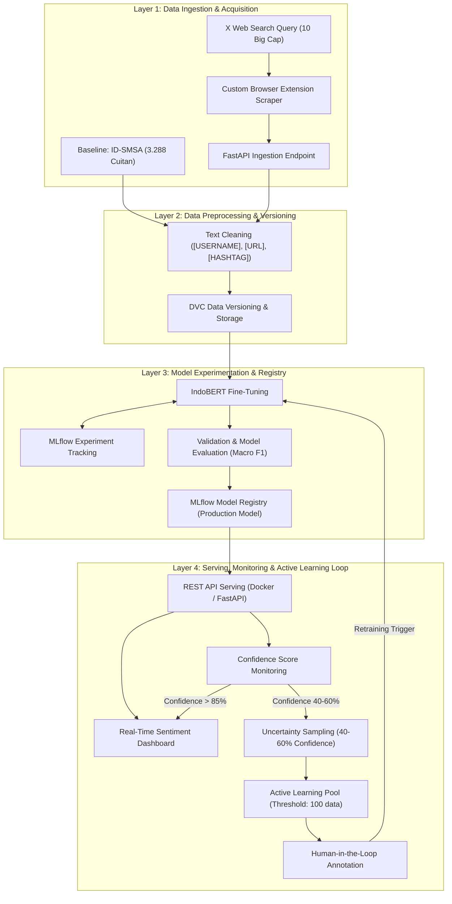

# MLOps: Penerapan MLOps Berkelanjutan untuk Analisis Sentimen Saham Big Cap Indonesia Menggunakan Uncertainty Sampling dan Data Dinamis

[](https://www.python.org/)
[](https://github.com/codespaces/new)
[](LICENSE)

---

## 📌 Informasi Mahasiswa
- **Nama:** Muhammad Sulthon Aulia Wijaya
- **NIM:** 245150207111103
- **Kelas:** TIF-A
- **Mata Kuliah:** MLOps
- **Program Studi:** Teknik Informatika, Fakultas Ilmu Komputer, Universitas Brawijaya (2026)

---

## 📖 Penjelasan Proyek
Proyek ini mengimplementasikan sistem **MLOps berkelanjutan (*Continuous Training & Active Learning*)** untuk klasifikasi sentimen (*positive*, *neutral*, *negative*) serta *Aspect-Based Sentiment Analysis* pada percakapan media sosial (X/Twitter) terkait 10 saham Big Cap di Bursa Efek Indonesia (IDX):
> **Daftar Saham:** `BBCA`, `BBRI`, `BMRI`, `BBNI`, `TLKM`, `ASII`, `UNVR`, `TPIA`, `HMSP`, `BYAN`.

### 📊 Dataset yang Digunakan
1. **Baseline Dataset:** **ID-SMSA (*Indonesian Stock Market Dataset for Sentiment Analysis*)**
   - **Sumber:** Mendeley Data (DOI: `10.17632/tn4vzs8tdw.3`)
   - **Jumlah:** 3.288 cuitan teranotasi (1.769 *Positive*, 733 *Neutral*, 786 *Negative*) periode 2021–2024.
   - **Fungsi:** Data awal untuk melatih model baseline IndoBERT v1.0.
2. **Data Dinamis (Cuitan Terbaru):**
   - **Metode:** Pengumpulan data harian secara mandiri melalui *Custom Browser Extension* (DOM parsing X Web) tanpa dependensi API X berbayar.
   - **Fungsi:** Sumber data dinamis untuk mendeteksi pergeseran pola bahasa (*data/concept drift*) dan pengayaan *Active Learning*.

### 💡 Pendekatan & Solusi MLOps
- **Tantangan:** Bahasa percakapan pasar modal sangat dinamis (*slang*, istilah *cuan, cut loss, ARA, ARB, window dressing*). Model tanpa pembaruan berkala akan mengalami penurunan performa akibat *concept drift* dan *covariate shift*.
- **Solusi Pipeline:**
  - **Baseline Training:** Fine-tuning IndoBERT menggunakan dataset ID-SMSA dan pelacakan eksperimen via MLflow.
  - **Continuous Ingestion:** Penyerapan data cuitan harian melalui FastAPI dan versioning dataset menggunakan DVC.
  - **Uncertainty Sampling & Retraining Loop:**
    - *Confidence > 85%* $\rightarrow$ Hasil prediksi disimpan dan ditampilkan pada dashboard.
    - *Confidence 40% – 60%* $\rightarrow$ Ditandai dan dikumpulkan ke **Active Learning Pool**.
    - *Pemicu Retraining* $\rightarrow$ Retraining model terpicu otomatis saat pool mencapai 100 data atau evaluasi berkala Macro F1-Score $< 0.75$.

---

## 🏗️ Arsitektur Pipeline



---

## 📂 Struktur Direktori

```text
mlops-stock-sentiment-uncertainty/
├── .devcontainer/
│   └── devcontainer.json        # Konfigurasi container otomatis GitHub Codespaces
├── config/
│   ├── config.yaml              # Hyperparameter, path, dan ambang batas retraining
│   └── .gitkeep
├── data/
│   ├── .gitignore               # Menjaga file data tidak ter-commit ke Git
│   ├── raw/
│   │   └── .gitkeep             # Dataset baseline ID-SMSA & hasil crawl mentah
│   ├── interim/
│   │   └── .gitkeep             # Data hasil pembersihan sementara
│   ├── processed/
│   │   └── .gitkeep             # Data siap training & active learning pool
│   └── external/
│       └── .gitkeep             # Kamus slang/lexicon finansial eksternal
├── models/
│   ├── .gitignore               # Menjaga bobot model biner (.pt, .bin) tidak ter-commit
│   └── .gitkeep                 # Folder checkpoint model terlatih
├── notebooks/
│   ├── 01_initial_eda.ipynb     # Notebook eksplorasi data baseline ID-SMSA
│   └── .gitkeep
├── src/
│   ├── __init__.py
│   ├── api/
│   │   ├── __init__.py
│   │   └── app.py               # REST API FastAPI untuk data ingestion & inferensi
│   ├── data/
│   │   ├── __init__.py
│   │   └── make_dataset.py      # Modul pembersihan & pra-pemrosesan data
│   ├── features/
│   │   ├── __init__.py
│   │   └── build_features.py    # Modul tokenisasi & feature engineering
│   ├── models/
│   │   ├── __init__.py
│   │   ├── train_model.py       # Pipeline pelatihan & tracking model
│   │   └── predict_model.py     # Logika inferensi & evaluasi ketidakpastian
│   └── utils/
│       ├── __init__.py
│       └── logger.py            # Utility logging standar
├── .gitignore                   # Aturan ignorasi Python, Venv, IDE, MLflow, OS
├── LICENSE                      # Lisensi MIT (2026)
├── requirements.txt             # Daftar dependensi library Python
└── README.md                    # Dokumentasi utama proyek
```

---

## 🚀 Panduan Menjalankan Proyek

### Opsi 1: Menjalankan di GitHub Codespaces (Rekomendasi)
Repositori ini telah dikonfigurasi dengan `.devcontainer/devcontainer.json` sehingga seluruh lingkungan kerja (Python 3.11, dependensi library, dan ekstensi VS Code) akan terpasang secara otomatis:

1. Klik tombol **Code** (berwarna hijau) di halaman utama repositori GitHub.
2. Pilih tab **Codespaces** lalu klik **Create codespace on main**.
3. Tunggu container selesai dibangun. Lingkungan kerja langsung siap digunakan.

### Opsi 2: Menjalankan Secara Lokal

1. **Clone repositori:**
   ```bash
   git clone https://github.com/sulthonaw/mlops-stock-sentiment-uncertainty.git
   cd mlops-stock-sentiment-uncertainty
   ```

2. **Buat dan aktifkan Virtual Environment:**
   ```bash
   # Windows (PowerShell)
   python -m venv .venv
   .venv\Scripts\Activate.ps1

   # Linux / macOS
   python3 -m venv .venv
   source .venv/bin/activate
   ```

3. **Install seluruh dependensi:**
   ```bash
   pip install --upgrade pip
   pip install -r requirements.txt
   ```
