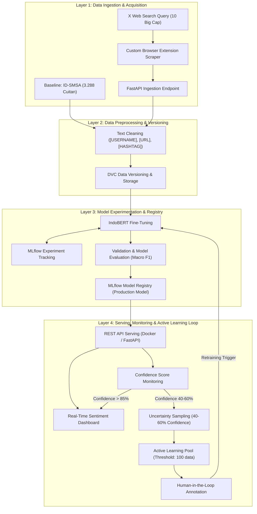

# MLOps: Penerapan MLOps Berkelanjutan untuk Analisis Sentimen Saham Big Cap Indonesia Menggunakan Uncertainty Sampling dan Data Dinamis

[](https://www.python.org/)
[](https://github.com/codespaces/new)
[](LICENSE)

---

## 📌 Informasi Mahasiswa
- **Nama:** Muhammad Sulthon Aulia Wijaya
- **NIM:** 245150207111103
- **Kelas:** TIF-A
- **Mata Kuliah:** MLOps
- **Program Studi:** Teknik Informatika, Fakultas Ilmu Komputer, Universitas Brawijaya (2026)

---

## 📖 Penjelasan Proyek
Proyek ini mengimplementasikan sistem **MLOps berkelanjutan (*Continuous Training & Active Learning*)** untuk klasifikasi sentimen (*positive*, *neutral*, *negative*) serta *Aspect-Based Sentiment Analysis* pada percakapan media sosial (X/Twitter) terkait 10 saham Big Cap di Bursa Efek Indonesia (IDX):
> **Daftar Saham:** `BBCA`, `BBRI`, `BMRI`, `BBNI`, `TLKM`, `ASII`, `UNVR`, `TPIA`, `HMSP`, `BYAN`.

### 📊 Dataset yang Digunakan
1. **Baseline Dataset:** **ID-SMSA (*Indonesian Stock Market Dataset for Sentiment Analysis*)**
   - **Sumber:** Mendeley Data (DOI: `10.17632/tn4vzs8tdw.3`)
   - **Jumlah:** 3.288 cuitan teranotasi (1.769 *Positive*, 733 *Neutral*, 786 *Negative*) periode 2021–2024.
   - **Fungsi:** Data awal untuk melatih model baseline IndoBERT v1.0.
2. **Data Dinamis (Cuitan Terbaru):**
   - **Metode:** Pengumpulan data harian secara mandiri melalui *Custom Browser Extension* (DOM parsing X Web) tanpa dependensi API X berbayar.
   - **Fungsi:** Sumber data dinamis untuk mendeteksi pergeseran pola bahasa (*data/concept drift*) dan pengayaan *Active Learning*.

### 💡 Pendekatan & Solusi MLOps
- **Tantangan:** Bahasa percakapan pasar modal sangat dinamis (*slang*, istilah *cuan, cut loss, ARA, ARB, window dressing*). Model tanpa pembaruan berkala akan mengalami penurunan performa akibat *concept drift* dan *covariate shift*.
- **Solusi Pipeline:**
  - **Baseline Training:** Fine-tuning IndoBERT menggunakan dataset ID-SMSA dan pelacakan eksperimen via MLflow.
  - **Continuous Ingestion:** Penyerapan data cuitan harian melalui FastAPI dan versioning dataset menggunakan DVC.
  - **Uncertainty Sampling & Retraining Loop:**
    - *Confidence > 85%* $\rightarrow$ Hasil prediksi disimpan dan ditampilkan pada dashboard.
    - *Confidence 40% – 60%* $\rightarrow$ Ditandai dan dikumpulkan ke **Active Learning Pool**.
    - *Pemicu Retraining* $\rightarrow$ Retraining model terpicu otomatis saat pool mencapai 100 data atau evaluasi berkala Macro F1-Score $< 0.75$.

---

## 🏗️ Arsitektur Pipeline



---

## 📂 Struktur Direktori

```text
mlops-stock-sentiment-uncertainty/
├── .devcontainer/
│   └── devcontainer.json        # Konfigurasi container otomatis GitHub Codespaces
├── config/
│   ├── config.yaml              # Hyperparameter, path, dan ambang batas retraining
│   └── .gitkeep
├── data/
│   ├── .gitignore               # Aturan ignorasi data (unignore crawl CSV & raw stream)
│   ├── raw/
│   │   ├── .gitkeep             # Dataset baseline ID-SMSA
│   │   ├── x_stock_tweets_*.csv # Cuitan mentah hasil crawl extension 10 saham Big Cap
│   │   └── raw_stream_*.json    # Batch konsolidasi stempel waktu & metadata
│   ├── interim/
│   │   ├── .gitkeep
│   │   └── interim_stream_*.parquet # Data bersih standar ID-SMSA (Parquet/CSV)
│   ├── processed/
│   │   └── .gitkeep             # Data siap training & active learning pool
│   └── external/
│       └── .gitkeep             # Kamus slang/lexicon finansial eksternal
├── models/
│   ├── .gitignore               # Menjaga bobot model biner (.pt, .bin) tidak ter-commit
│   └── .gitkeep                 # Folder checkpoint model terlatih
├── notebooks/
│   ├── 01_initial_eda.ipynb     # Notebook eksplorasi data baseline ID-SMSA
│   └── .gitkeep
├── src/
│   ├── __init__.py
│   ├── ingest_data.py           # Penarikan, validasi, & konsolidasi data dinamis
│   ├── preprocess.py            # Automasi normalisasi teks standar ID-SMSA
│   ├── api/
│   │   ├── __init__.py
│   │   └── app.py               # REST API FastAPI untuk data ingestion & inferensi
│   ├── data/
│   │   ├── __init__.py
│   │   └── make_dataset.py      # Modul pembersihan & pra-pemrosesan data
│   ├── features/
│   │   ├── __init__.py
│   │   └── build_features.py    # Modul tokenisasi & feature engineering
│   ├── models/
│   │   ├── __init__.py
│   │   ├── train_model.py       # Pipeline pelatihan & tracking model
│   │   └── predict_model.py     # Logika inferensi & evaluasi ketidakpastian
│   └── utils/
│       ├── __init__.py
│       └── logger.py            # Utility logging standar
├── .gitignore                   # Aturan ignorasi Python, Venv, IDE, MLflow, OS
├── LICENSE                      # Lisensi MIT (2026)
├── requirements.txt             # Daftar dependensi library Python
└── README.md                    # Dokumentasi utama proyek
```

---

## 🚀 Panduan Menjalankan Proyek

### Opsi 1: Menjalankan di GitHub Codespaces (Rekomendasi)
Repositori ini telah dikonfigurasi dengan `.devcontainer/devcontainer.json` sehingga seluruh lingkungan kerja (Python 3.11, dependensi library, dan ekstensi VS Code) akan terpasang secara otomatis:

1. Klik tombol **Code** (berwarna hijau) di halaman utama repositori GitHub.
2. Pilih tab **Codespaces** lalu klik **Create codespace on main**.
3. Tunggu container selesai dibangun. Lingkungan kerja langsung siap digunakan.

### Opsi 2: Menjalankan Secara Lokal

1. **Clone repositori:**
   ```bash
   git clone https://github.com/sulthonaw/mlops-stock-sentiment-uncertainty.git
   cd mlops-stock-sentiment-uncertainty
   ```

2. **Buat dan aktifkan Virtual Environment:**
   ```bash
   # Windows (PowerShell)
   python -m venv .venv
   .venv\Scripts\Activate.ps1

   # Linux / macOS
   python3 -m venv .venv
   source .venv/bin/activate
   ```

3. **Install seluruh dependensi:**
   ```bash
   pip install --upgrade pip
   pip install -r requirements.txt
   ```

---

## 📥 Implementasi LK-04: Penarikan Data Dinamis & Automasi Prapemrosesan

Pada tahapan **LK-04**, pipeline MLOps ini telah dilengkapi dengan komponen penarikan data (*data ingestion*) dinamis dan automasi prapemrosesan (*text preprocessing automation*) untuk mengolah percakapan saham mentah dari platform X secara terstruktur dan non-destruktif.

### 1. Format Data Mentah Hasil Web Crawling
Data mentah dikumpulkan menggunakan *custom browser extension* tanpa biaya API berbayar dengan menyasar 10 emiten saham Big Cap Indonesia:
`$BBCA`, `$BBRI`, `$BMRI`, `$BBNI`, `$TLKM`, `$ASII`, `$UNVR`, `$TPIA`, `$HMSP`, `$BYAN`.

Berkas hasil crawl disimpan langsung pada `data/raw/x_stock_tweets_*.csv` dengan skema yang telah diselaraskan dengan baseline ID-SMSA:
- `Sentence`: Teks cuitan mentah pengguna.
- `Sentiment`: Label sentimen (`null` / *unlabeled* untuk data dinamis).
- `Tweet Date`: Waktu cuitan dibuat (format string Twitter).
- `English Translation`: Terjemahan bahasa Inggris (opsional).
- `Favorite Count`: Jumlah suka (*like*).
- `Retweet Count`: Jumlah cuitan ulang (*retweet*).
- `Reply Count`: Jumlah balasan (*reply*).
- `Quote Count`: Jumlah kutipan (*quote*).

### 2. Skrip Ingestion Dinamis (`src/ingest_data.py`)
Skrip ini bertugas memindai, memvalidasi skema, mendeteksi emiten, dan mengonsolidasi berkas crawl ke dalam format batch stream berstempel waktu tanpa menimpa (*non-destructive*) file lama.

**Fitur Utama:**
- **Validasi Skema Otomatis:** Memastikan keberadaan dan urutan 8 kolom standar.
- **Konsolidasi Berstempel Waktu:** Menghasilkan berkas baru `data/raw/raw_stream_%Y%m%d_%H%M%S.json` dan `.csv`.
- **Batch Metadata Tracking:** Mencatat `ingestion_timestamp`, `batch_id`, `total_records`, daftar emiten (`tickers`), `schema_version`, dan file sumber.
- **Simulasi Live Stream (`--mock-new`):** Menyediakan opsi simulasi penambahan data cuitan baru terkini untuk pengujian berkala.

**Contoh Eksekusi CLI Ingestion:**
```bash
# 1. Ingest seluruh berkas crawl mentah (ekspor JSON dan CSV)
python src/ingest_data.py --format both

# 2. Ingest berkas crawl mentah sekaligus menyimulasikan data stream baru
python src/ingest_data.py --mock-new --mock-count 10 --format both
```

### 3. Automasi Prapemrosesan Data (`src/preprocess.py`)
Skrip ini mentransformasi cuitan mentah dari `data/raw/` menjadi korpus bersih terstandarisasi di `data/interim/`.

**Tahapan Normalisasi (Konsisten Standar ID-SMSA):**
1. **Normalisasi Akun (`@username`):** Diganti menjadi token `[USERNAME]`.
2. **Normalisasi Tautan (URL):** Diganti menjadi token `[URL]`.
3. **Normalisasi Tagar (`#hashtag`):** Diganti menjadi token `[HASHTAG]`.
4. **Pembersihan Whitespace:** Menghilangkan baris baru berlebih (`\n\r`) dan mereduksi spasi ganda menjadi spasi tunggal.
5. **Penanganan Missing Values:** Menghapus baris dengan teks kosong atau `NaN`.
6. **Deduplikasi Teks:** Menghapus entri cuitan duplikat berdasarkan kolom `Sentence`.
7. **Penyimpanan Berkas Interim:** Disimpan ke `data/interim/interim_stream_<source>_<timestamp>.parquet` dan `.csv` disertai berkas metadata pelacak.

**Contoh Eksekusi CLI Prapemrosesan:**
```bash
# 1. Prapemrosesan batch stream terbaru otomatis dari data/raw/
python src/preprocess.py --format both

# 2. Prapemrosesan berkas batch mentah spesifik
python src/preprocess.py --input-path data/raw/raw_stream_20260928_144339.json --format both
```

**Ringkasan Log Terminal yang Dihasilkan:**
```text
============================================================
           RINGKASAN PRAPEMROSESAN DATA (LK-04)
============================================================
Berkas Sumber        : raw_stream_20260928_144339.json
Jumlah Baris Awal    : 211
Missing Values Dibuang: 0
Duplikat Dihapus     : 66
Total Baris Bersih   : 145
Format Ekspor        : both
Direktori Output     : E:\mlops-stock-sentiment-uncertainty\data\interim
============================================================
```
